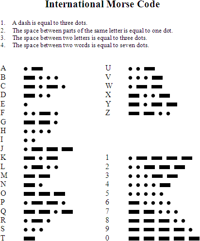

# Morse library

Morse library based on a double array for storing the morse dictionary. See [this other repository](https://github.com/AlvaroRuizDelgado/MorseConversionSpeedComparison) for further detail on speed considerations when choosing the data structure to hold this information.

It is still a work in progress, but the intention is to create a simple library that will play the morse sounds for an input string.

## Details


## Morse conversion table



## Compilation

Compilation and execution of each example:
```bash
g++ *.cpp -o test.exe
./test.exe
```
